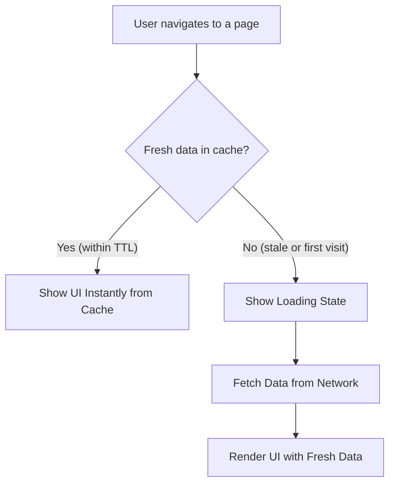
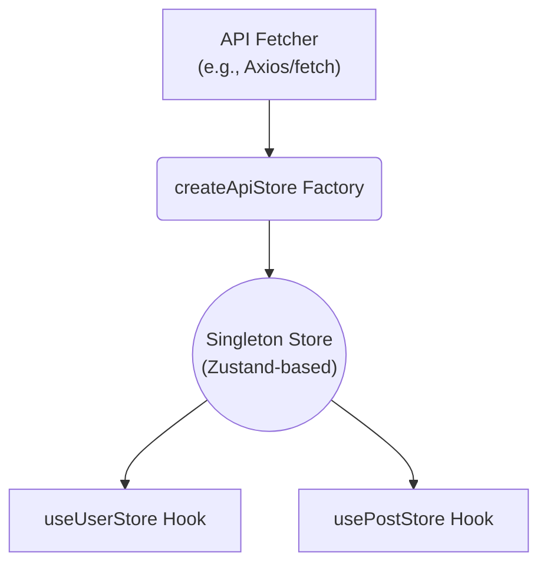

# factora

[](https://www.npmjs.com/package/factora)
[](https://github.com/travelr/factora)
[](https://github.com/travelr/factora/blob/main/LICENSE)

**`factora` is a factory that creates zero-config, singleton data-fetching hooks for React — handling caching, retries, and garbage collection out of the box.**

---

### Key Benefits

- ⚡️ **Snappy UI with smart caching:** On return navigations, freshly cached data (within its TTL) is displayed instantly so users often avoid loading spinners entirely.
- 💪 **Resilient UI with automatic retries:** Transient network errors are retried automatically with exponential backoff, preventing temporary glitches from breaking your UI.
- 🗑️ **Effortless memory management:** Queries no longer used by any component are garbage-collected automatically, helping avoid memory leaks in long-running apps.
- 🔒 **Catch bugs at compile time:** Create fully typed hooks where data shapes, errors, and fetcher parameters are inferred — ensuring type safety from your API layer to the UI.

---

### The Factory Pattern: A Centralized Data Layer

`factora` follows a simple, powerful principle: centralize your data-fetching logic so it’s consistent and reusable. The `createApiStore` factory implements this by letting you define each data source once and reuse the resulting hooks everywhere.

Benefits for teams:

1. **Guaranteed consistency:** Every component uses the same preconfigured hook, so caching, retries, and related behaviors stay uniform.
2. **Simplified components:** UI code stays focused on rendering — not on complex fetch logic.
3. **Easy maintenance:** Change how an endpoint is fetched or cached in one place and the whole app picks it up.

---

### The `factora` Caching Lifecycle

This diagram explains how `factora` makes the UI feel instant by preferring fresh cached data.



The critical path is the **"Yes"** branch: when data is fresh, the UI renders immediately without a network round trip.

---

### How It Works: The Core Architecture

`factora` provides out-of-the-box solutions to difficult async problems.



| Feature                          | How It Works                                                                                                                                          |
| -------------------------------- | ----------------------------------------------------------------------------------------------------------------------------------------------------- |
| **Request Deduplication**        | If 10 components call `usePostStore({ postId: 1 })` simultaneously, only **one** network request is made.                                             |
| **Race Condition Prevention**    | An internal token system ensures results from older, slower requests cannot overwrite newer results.                                                  |
| **Automatic Garbage Collection** | The central store tracks subscribers for each query. Once no components are subscribed, the cache entry is cleared after a configurable grace period. |

---

### Guaranteed Robustness: Race Condition Handling & Testing

`factora` is designed to be resilient in real-world apps and is covered by a comprehensive test suite.

#### Race Condition Prevention

To avoid stale results overwriting fresh ones, `factora` uses an **internal token-based mechanism**. If a newer request for the same resource resolves first, older responses are ignored safely.

#### Comprehensive Testing

The library is validated by an extensive test suite covering low-level utilities and high-level integration scenarios, including caching, retries, garbage collection, and the tricky race conditions.

For full technical details:

- 📘 **[Architecture](docs/api-store-factory.md)**
- 🧪 **[Testing Strategy](docs/api-store-factory.tests.md)**

---

### A Practical Example: Building a Data Layer

Below is a concise example that shows how to centralize hooks for a blog.

#### Step 1: Create a Centralized API Fetcher (`api.ts`)

This file contains your raw data-fetching logic. It knows how to talk to your API but knows nothing about React.

```ts
// src/api.ts
import axios, { type AbortSignal } from "axios";

// Define your data shapes
export interface Post {
  id: number;
  title: string;
  body: string;
  userId: number;
}
export interface User {
  id: number;
  name: string;
}

const apiClient = axios.create({
  baseURL: "https://jsonplaceholder.typicode.com",
});

// Create a generic fetcher for your API
export const apiFetcher = async <T>(
  endpoint: string,
  params: Record<string, any>,
  signal?: AbortSignal
): Promise<T> => {
  const response = await apiClient.get(endpoint, { params, signal });
  return response.data;
};
```

#### Step 2: Create Your Store Hooks (`stores.ts`)

This file becomes the single source of truth for your application's data layer, ensuring all hooks are consistent.

```ts
// src/stores.ts
import { createApiStore } from "factora";
import { apiFetcher, type Post, type User } from "./api";

const defaultOptions = {
  cacheTTL: 5 * 60 * 1000, // 5-minute cache
  retryAttempts: 2,
};

// Create and export singleton hooks for each data type.
export const usePostsStore = createApiStore<Post[]>(
  "/posts",
  apiFetcher,
  defaultOptions
);
export const usePostStore = createApiStore<Post>(
  "/posts/:postId",
  apiFetcher,
  defaultOptions
);
export const useUserStore = createApiStore<User>(
  "/users/:userId",
  apiFetcher,
  defaultOptions
);
```

#### Step 3: Use the Hooks in Your Components

Your UI components import the pre-configured hooks and remain clean, declarative, and decoupled from the fetching implementation. This example also shows how to handle dependent queries.

```tsx
// src/components/PostDetails.tsx
import { usePostStore, useUserStore } from "../stores";

// A sub-component for fetching and displaying the author.
// It will only be rendered when we have a userId.
function AuthorDetails({ userId }: { userId: number }) {
  const { data: author, isLoading } = useUserStore({ userId });

  if (isLoading) return <p>Loading author...</p>;
  return <p>By: {author?.name ?? "Unknown"}</p>;
}

function PostDetails({ postId }: { postId: string }) {
  // Fetch the post
  const { data: post, isLoading: isPostLoading } = usePostStore({ postId });

  if (isPostLoading) return <div>Loading post...</div>;
  if (!post) return <div>Post not found.</div>;

  return (
    <article>
      <h1>{post.title}</h1>
      {/* Conditionally render the AuthorDetails component to fetch the author */}
      {post.userId && <AuthorDetails userId={post.userId} />}
      <p>{post.body}</p>
    </article>
  );
}
```

---

### Contributing & License

Contributions are welcome. Open an issue or submit a pull request. This project is released under the [MIT license](https://github.com/travelr/factora/blob/main/LICENSE).
