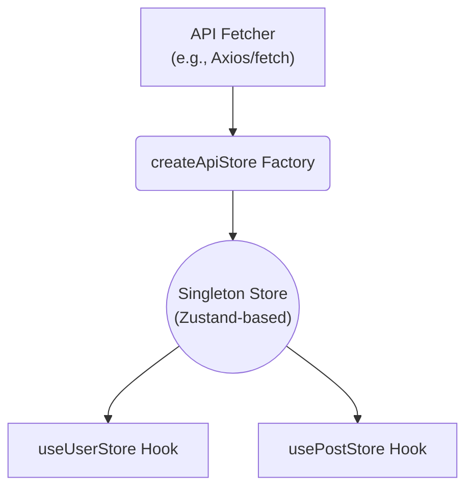

# factora

[](https://www.npmjs.com/package/factora)
[](https://github.com/travelr/factora)
[](https://github.com/travelr/factora/blob/main/LICENSE)

**`factora` is a factory that creates zero-config, singleton data-fetching hooks for React — with caching, retries, and garbage collection built in.**

---

### Key Benefits

- ⚡️ **Snappy UI with smart caching:** When returning to a page, freshly cached data (within its TTL) is shown instantly, often eliminating loading spinners.
- 💪 **Resilient UI with automatic retries:** Transient network errors are retried automatically with an exponential backoff. So that temporary glitches don’t break your UI.
- 🗑️ **Effortless memory management:** Queries no longer used by any component are garbage-collected automatically. This avoids memory leaks in long-running apps.
- 🏛️ **Build a True Data Layer:** `factora` provides the foundation to separate your data-fetching _infrastructure_ from your _business logic_, enabling a clean, scalable, and type-safe architecture.

---

### The Factory Pattern: A Centralized Data Layer

`factora` follows a simple principle: centralize data-fetching logic to keep it consistent and reusable. The factory functions let you define each data source once and use the resulting hooks everywhere.

This provides immediate benefits for teams:

1.  **Consistency Guaranteed:** Every component relies on the same pre-configured hook, keeping caching and retry behavior identical across your entire application.
2.  **Simpler Components:** UI code focuses purely on rendering state—not on the complex mechanics of how or when to fetch data.
3.  **Easy Maintenance:** Change how an endpoint is fetched or cached in one place, and the whole app updates automatically.

This approach naturally encourages a clean separation of concerns that aligns with principles like Domain-Driven Design (DDD). You can structure your application into distinct layers:

- **Infrastructure Layer:** The `factora` hooks you create become your reusable, application-wide "repositories." They handle the mechanics of data fetching.
- **Business Layer:** You can create your own custom hooks that contain your business logic. They orchestrate calls to the infrastructure hooks to compose data perfectly aligned to your UI components.
- **Presentation Layer:** Your React components become the clean, declarative presentation layer.

This separation makes your components simpler, your business logic more explicit and testable, and your data-fetching consistent by default.

---

### Installation

```bash
pnpm add factora
```

#### Peer Dependencies

`factora` requires [React](https://github.com/facebook/react) and [Zustand](https://github.com/pmndrs/zustand) to be installed in your project:

```bash
pnpm add react zustand
```

#### Optional Dependencies for the Default Setup

For the simplest, out-of-the-box experience with `createApiStore`, you'll need [Axios](https://github.com/axios/axios) and [Loglevel](https://github.com/pimterry/loglevel).

```bash
pnpm add axios loglevel
```

If you do not install these, you must use the **Pure Factory Pattern** described below.

---

### Global Services Setup

For features like automatic garbage collection and refetch-on-focus to work, you need to initialize `factora`'s global services once in your application's root component (e.g., `App.tsx`).

```typescript
// src/App.tsx
import React, { useEffect } from 'react';
import {
  initializeApiRegistry,
  startApiStoreGarbageCollector,
  stopApiStoreGarbageCollector,
} from 'factora';
import { loglevelAdapter } from 'factora/adapter/loglevel';

// Inject the logger into Factora's global registry
initializeApiRegistry({ logger: loglevelAdapter });

function App() {
  useEffect(() => {
    // Start the Garbage Collector, providing it with a logger (here loglevel)
    startApiStoreGarbageCollector({ logger: loglevelAdapter });
    return () => stopApiStoreGarbageCollector();
  }, []);

  // ... rest of your application
}
```

---

### Core Features

`factora` provides out-of-the-box solutions to difficult async problems.



| Feature                            | Description                                                                                                                          |
| ---------------------------------- | ------------------------------------------------------------------------------------------------------------------------------------ |
| **Request Deduplication**          | If 10 components call `useUserStore({ userId: 3 })` at once, only **one** network request runs.                                      |
| **Configurable Caching (TTL)**     | Define a `cacheTTL` (ms). Data within its TTL is served instantly from cache, skipping the network.                                  |
| **Automatic Retries**              | Configure `retryAttempts` and `retryDelay`. Failed requests retry automatically with exponential backoff.                            |
| **Automatic Garbage Collection**   | The store tracks subscribers. Once none remain, the cache entry clears after a grace period.                                         |
| **Automatic Refetching (Polling)** | Set `refetchIntervalMinutes` to refresh data periodically, keeping your UI up to date.                                               |
| **Manual Actions**                 | The hooks return stable `refetch()` and `clear()` methods, giving you control to refresh or clear a specific query’s cache manually. |

The foundation for avoiding race conditions is the concept of `inFlightPromise`. It will act as a unique "lock" to prevent duplicate requests and will make sure that slower responses never overwrite newer ones. See details of the implementation **[here](docs/api-store-factory.md)**.

---

### Architecture & Testing Strategy

`factora` is built for resilience in real-world apps and is covered by a comprehensive test suite.

Tests cover everything from low-level utilities to full integration flows, including caching, retries, garbage collection, and complex race conditions.

v8 shows a test coverage greater **90%**

For more details:

- 📘 **[Architecture](docs/api-store-factory.md)**
- 🧪 **[Testing Strategy](docs/api-store-factory.tests.md)**

---

### A Practical Example: Building a Data Layer

Here’s a simple example of how to centralize hooks for a blog.

#### Step 1: Create a Centralized API Fetcher (`blog-api.ts`)

This file contains raw data-fetching logic specific to an endpoint.

```ts
// src/api/blog-api.ts
import axios, { type AbortSignal } from 'axios';

// Define your data shapes
export interface Post {
  id: number;
  title: string;
  body: string;
  userId: number;
}
export interface User {
  id: number;
  name: string;
}

const apiClient = axios.create({
  baseURL: 'https://jsonplaceholder.typicode.com',
});

// Generic fetcher
export const apiFetcher = async <T>(
  endpoint: string,
  params: Record<string, any>,
  signal?: AbortSignal,
): Promise<T> => {
  const response = await apiClient.get(endpoint, { params, signal });
  return response.data;
};
```

#### Step 2: Create Your Store Hooks (`blog-stores.ts`)

This file is the single source of truth for your data layer.

```ts
// src/stores/blog-stores.ts
import { createApiStore } from 'factora';
import { apiFetcher, type Post, type User } from '../api/blog-api';

const defaultOptions = {
  cacheTTL: 5 * 60 * 1000, // 5 minutes
  retryAttempts: 2,
};

// Singleton hooks for each data type
export const usePostsStore = createApiStore<Post[]>(
  '/posts',
  apiFetcher,
  defaultOptions,
);
export const usePostStore = createApiStore<Post>(
  '/posts/:postId',
  apiFetcher,
  defaultOptions,
);
export const useUserStore = createApiStore<User>(
  '/users/:userId',
  apiFetcher,
  defaultOptions,
);
```

#### Step 3: Use the Hooks in Your Components

Your UI components import the pre-configured hooks and remain clean and declarative.

```tsx
// src/components/PostDetails.tsx
import { usePostStore, useUserStore } from '../stores/blog-stores';

function AuthorDetails({ userId }: { userId: number }) {
  // Only one netowrk request per userId, even if called multiple times (within TTL)
  const { data: author, isLoading } = useUserStore({ userId });
  if (isLoading) return <p>Loading author...</p>;
  return <p>By: {author?.name ?? 'Unknown'}</p>;
}

function PostDetails({ postId }: { postId: string }) {
  // Fetch the post
  const { data: post, isLoading: isPostLoading } = usePostStore({ postId });

  if (isPostLoading) return <div>Loading post...</div>;
  if (!post) return <div>Post not found.</div>;

  return (
    <article>
      <h1>{post.title}</h1>
      {/* Conditionally render the AuthorDetails component to fetch the author */}
      {post.userId && <AuthorDetails userId={post.userId} />}
      <p>{post.body}</p>
    </article>
  );
}
```

---

### Advanced Usage: The Pure Factory Pattern

`factora` is built on a dependency-injected pure core, allowing you to use it with any data-fetching client or logger. To do this, you use the `createApiFactoryPure` function from the `factora/pure` entry point, which requires you to provide all dependencies.

This is ideal for projects that use the native `fetch` API or a different logging library like `pino`.

#### Example with `fetch` and `pino`

```typescript
// src/api/api-factory-setup.ts
import { createApiFactoryPure } from 'factora/pure';
import type { FactoraLogger } from 'factora/pure';
import pino from 'pino';

// 1. Create your custom logger adapter
const pinoLogger = pino();
const pinoAdapter: FactoraLogger = {
  info: (...args) => pinoLogger.info(args),
  warn: (...args) => pinoLogger.warn(args),
  error: (...args) => pinoLogger.error(args),
  debug: (...args) => pinoLogger.debug(args),
  getLevel: () => pinoLogger.levelVal,
  levels: { DEBUG: 20 },
};

// 2. Create your custom error mapper for `fetch`
const myErrorMapper = async (error: unknown, context) => {
  const message = error instanceof Error ? error.message : 'Fetch error';
  return { message, retryable: false, context };
};

// 3. Create your reusable factory
const myAppApiFactory = createApiFactoryPure({
  errorMapper: myErrorMapper,
  logger: pinoAdapter,
});

// 4. Use the factory to create stores with your fetch-based fetcher
const fetchBasedFetcher = async (endpoint, params, signal) => {
  const url = new URL(endpoint, 'https://my-api.com');
  url.search = new URLSearchParams(params).toString();
  const res = await fetch(url, { signal });
  if (!res.ok) throw new Error('Network response was not ok');
  return res.json();
};

export const useProductStore = myAppApiFactory('/products', fetchBasedFetcher);
```

### Contributing & License

Contributions are welcome! Open an issue or submit a pull request.
This project is released under the [MIT license](https://github.com/travelr/factora/blob/main/LICENSE).
