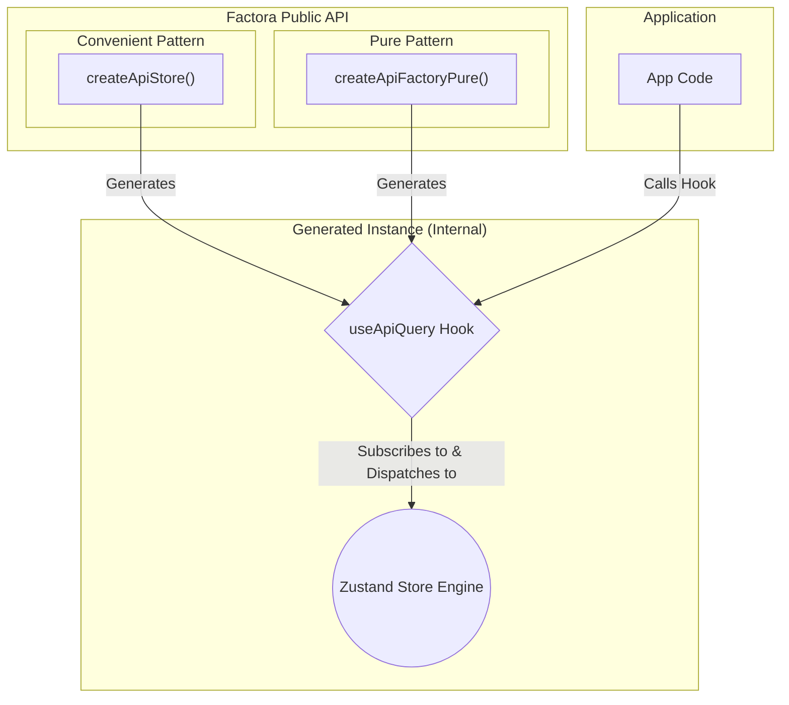
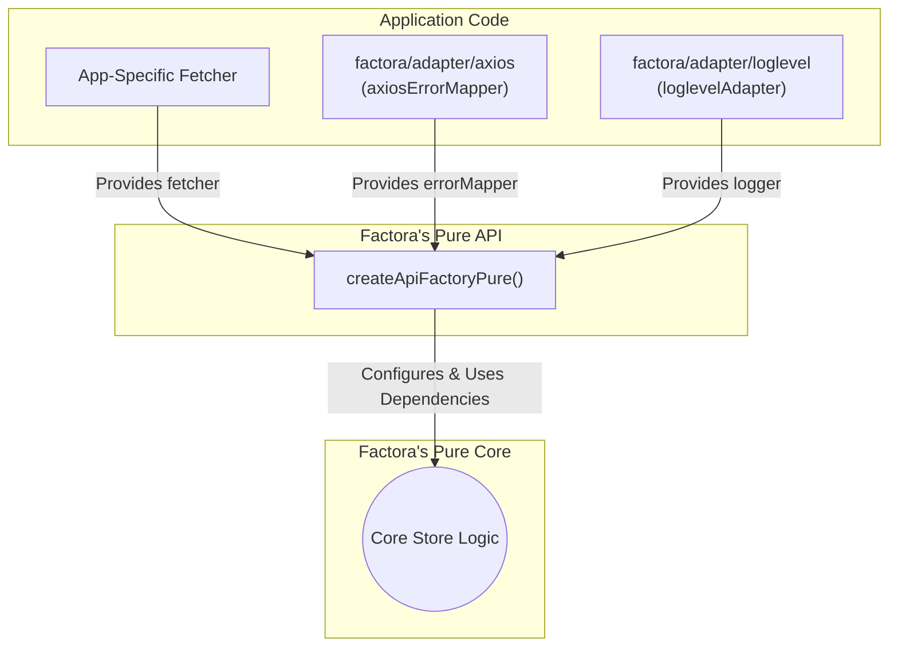
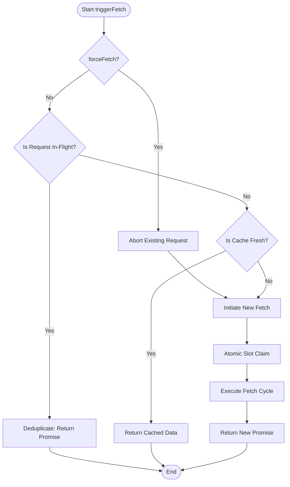
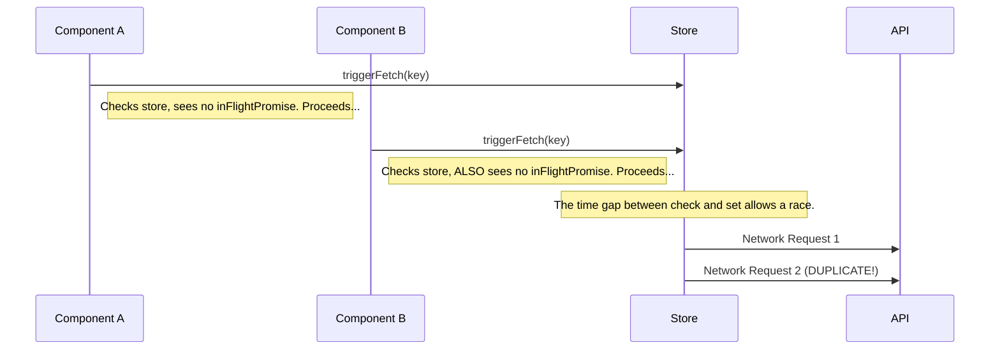
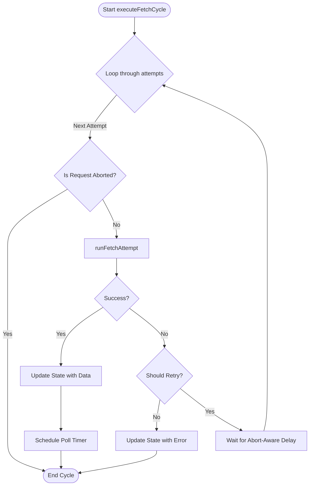
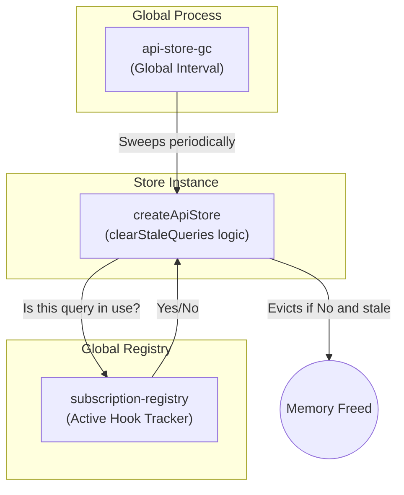

<details><summary>Relevant source files</summary>

The following files were used as context for generating this documentation:

- `src/index.ts` (Convenient Entry Point)
- `src/pure.ts` (Pure Entry Point)
- `src/core/index.ts` (Internal Core Factory)
- `src/core/api-store-factory.ts` (Core Store Logic)
- `src/core/api-store-gc.ts` (Garbage Collector)
- `src/core/api-store-registry.ts` (Global Registry)
- `src/adapter/axios.ts` (Axios Error Mapper)
- `src/adapter/loglevel.ts` (Loglevel Logger)
- `src/types/dependencies.ts` (DI Contracts)

</details>

&nbsp;

# API Store Factory

---

## Introduction

The API Store Factory is a centralized, robust solution for fetching, caching, and managing server state in the application. It provides factory functions that generate a dedicated Zustand store and a corresponding React hook (`useApiQuery`) for a specific API resource.

The architecture is built on a **dependency-injected pure core** with optional adapters. This promotes a clear separation of concerns: the generated store acts as a powerful, centralized engine for all data fetching logic, while the hook provides a simple, declarative API for React components to consume that data. This design makes the library flexible, testable, and ensures consumers only bundle the dependencies they actually use.

`Sources: src/core/api-store-factory.ts:1-24, src/index.ts:1-5, src/pure.ts:1-5`

---

## Core Architecture & Design Philosophy

The system is built on a factory pattern. Instead of a single monolithic store for all API data, a new, isolated store instance is created for each logical API resource (e.g., `/assets`). This prevents state collisions and keeps the concerns for each data type separate.

The library now offers two distinct entry points to accommodate different project needs: a simple, pre-configured setup for convenience, and a pure, fully decoupled setup for advanced customization.



### The Role of Zustand: A Global State Engine

It is critical to understand that a Zustand store is a **single, global, non-React state object**. It lives outside the React component tree. The `useApiQuery` hook acts as a "window" or "selector" into this global state. When a component using the hook unmounts, it simply **unsubscribes** from updates. The data and any in-flight requests in the global store **persist**. This is the foundation of the shared cache model.

`Sources: src/core/api-store-factory.ts:107-123`

## How to Create a New API Store

Creating a new store involves two main steps: defining your data fetching logic and then using one of the factory functions to generate the hook.

### Pattern 1: Convenient Factory (`createApiStore`)

This is the recommended approach for most use cases. It provides a single function that has already been configured with standard adapters for error handling (`axiosErrorMapper`) and logging (`loglevelAdapter`). The developer only needs to provide their own data-fetching logic. `Sources: src/index.ts:39-76`

```typescript
// src/stores/firefly-store.ts
import { createApiStore } from 'factora'; // Import from the convenient entry point
import { FireflyAccount } from '@app-types/firefly-types';
import axios from 'axios';

// 1. Define the data-fetching logic.
// This allows for handling custom API response envelopes.
const fireflyFetcher = async (
  endpoint: string,
  params: Record<string, any>,
  signal?: AbortSignal,
): Promise<FireflyAccount[]> => {
  const response = await axios.get(endpoint, { params, signal });
  // Example of unwrapping a response: return response.data.payload;
  return response.data;
};

// 2. Call the factory with the path and fetcher, then export the hook.
export const useFireflyAccountStore = createApiStore(
  '/api/v1/accounts',
  fireflyFetcher,
  {
    cacheTTL: 10 * 60 * 1000, // 10-minute cache
    description: 'Firefly Accounts',
  },
);
```

### Pattern 2: Pure Factory (`createApiFactoryPure`)

This pattern provides maximum control and is intended for projects with custom requirements (e.g., using `fetch` instead of Axios). It requires the developer to explicitly construct the factory by providing all dependencies. `Sources: src/pure.ts:17, src/core/index.ts:22-38`

```typescript
// src/api/api-factory-setup.ts
import { createApiFactoryPure } from 'factora/pure';
import { axiosErrorMapper } from 'factora/adapter/axios';
import { loglevelAdapter } from 'factora/adapter/loglevel';

// 1. Create a reusable, application-wide factory by providing all dependencies.
const myAppApiFactory = createApiFactoryPure({
  errorMapper: axiosErrorMapper,
  logger: loglevelAdapter,
});

// 2. Use the new factory to create store hooks, providing the fetcher each time.
// export const useSomeStore = myAppApiFactory('/api/other', someFetcher);
```

### Step 2: Use the Hook in Components

Once created, your new hook is ready to be used anywhere in your application.

```typescript
const { data, loading, error } = useFireflyAccountStore({ type: 'asset' });
```

---

## The Dependency Injection Contract

The entire library is built upon the principle of **Dependency Injection (DI)**, a form of Inversion of Control. Instead of the library's core creating its own dependencies (like a logger or an Axios instance), it requires them to be "injected" from the outside. This is the key to its flexibility, testability, and support for tree-shaking.

This contract is formally defined by a set of TypeScript interfaces, primarily the `FactoraDependencies` interface. The pure core of the library only ever interacts with these abstract contracts, not with any concrete implementation like Axios or Loglevel.

### The Core Contract: `FactoraDependencies`

This interface is the "shopping list" of services that the `createApiFactoryPure` function requires to operate. It bundles all external logic into a single object.

| Property          | Type Signature                             | Responsibility                                                                                            |
| :---------------- | :----------------------------------------- | :-------------------------------------------------------------------------------------------------------- |
| **`fetcher`**     | `(endpoint, params, signal) => Promise<T>` | To perform the actual network request and return data. **This is provided by the application developer.** |
| **`errorMapper`** | `(error, context) => ApiError`             | To inspect any error thrown by the `fetcher` and normalize it into a standardized `ApiError` object.      |
| **`logger`**      | `FactoraLogger`                            | To handle internal logging within the library, such as for the Garbage Collector or unexpected errors.    |

`Sources: src/types/dependencies.ts:23`

The following diagram illustrates how the application provides concrete implementations (the adapters and the fetcher) that fulfill the contract required by the pure factory.



### Detailed Breakdown of the Contract

#### The `fetcher` Contract

This is the most critical part of the contract that the application developer implements. It defines the shape of the function responsible for actually fetching data. The library's core is unopinionated about _how_ you fetch data; it only cares that the function you provide returns a `Promise` that resolves with the expected data. This allows you to use `axios`, the native `fetch` API, or any other data-fetching client.

#### The `errorMapper` Contract

The `errorMapper`'s job is to act as a **normalizer**. Network errors can come in many shapes and sizes. This function's responsibility is to take any `unknown` error thrown by the `fetcher` and transform it into a predictable `ApiError` object. This is where library-specific knowledge is encapsulated.

The provided `axiosErrorMapper` is a sophisticated implementation of this contract that knows how to inspect an `AxiosError` for status codes, `Retry-After` headers, and timeout codes to correctly populate the `retryable` and `retryAfter` fields.

`Sources: src/adapter/axios.ts:74`

#### The `logger` Contract

This defines a simple interface for logging messages. The library's core uses the injected logger to report on internal events, such as the Garbage Collector cleaning up stores or an unexpected failure within one of the dependencies (like the `errorMapper` itself crashing).

The provided `loglevelAdapter` is a thin wrapper that implements this interface by delegating all calls to the `loglevel` library.

`Sources: src/adapter/loglevel.ts:11`

---

## The Global Cache

The "global cache" for each store instance is the `queries` object managed within the **Zustand store**. This object is the single source of truth for all data, loading, and error states for that specific API resource. The factory uses Zustand's `create` function to build a store that holds this state, living outside the React component tree, which allows it to persist and be shared across components.

### What is Stored in the Cache?

The `queries` object is a JavaScript map where keys are unique, serialized query strings and values are `QueryState` objects. The key is a unique identifier for a specific API call, including its exact URL parameters.

`Sources: src/core/api-store-factory.ts:60-62`

After a component calls `useFireflyAccounts({ type: 'asset' })`, the `queries` object inside the Zustand store's state would look like this:

```javascript
// Inside the Zustand store's state:
{
 queries: {
   // The unique, serialized key
   "{\"endpoint\":\"/api/v1/accounts\",\"params\":{\"type\":\"asset\"}}": {
     // The QueryState object for this specific query
     "data": [{...}, {...}],
     "error": null,
     "lastFetchTimestamp": 1678886400000,
     "inFlightPromise": undefined,
     "abortController": undefined,
     "refetchTimerId": 123
   }
 },
 queryCount: 1
 // ...other global state properties
}
```

This granularity ensures that every unique combination of parameters gets its own separate entry in the cache, preventing data from one query from ever overwriting another.

---

## The `triggerFetch` Logic Flow

The `triggerFetch` function is the main entry point and "brain" of the store. It follows a clear, prioritized sequence to handle any request. The function first checks if a `forceFetch` is requested, which bypasses all checks and initiates a new fetch. If not, it checks for an in-flight request to prevent duplicates. Finally, it checks for fresh data in the cache. Only if none of these conditions are met will it proceed to initiate a new fetch cycle.



`Sources: src/core/api-store-factory.ts:389-456`

## Concurrency & Race Condition Mitigation

The core of this factory's design is its resilience to asynchronous race conditions. The store contains several specific mechanisms to handle dangerous edge cases that arise from overlapping network requests and state updates.

### Problem: Duplicate Requests on Initial Render

In React, two components can mount simultaneously (e.g., in `StrictMode`). Both could call `triggerFetch` for the same key _before_ the store's state has been updated to reflect that a fetch has started. This is a classic "Time-of-check to time-of-use" (TOCTOU) vulnerability that leads to redundant network calls.



#### Solution: Atomic Slot Claim with a Deferred Promise

The store prevents this race condition by separating promise creation from async execution.

1.  A `Promise` object is created using a `defer()` utility.
2.  This `Promise` is **immediately and synchronously** stored in the state as `inFlightPromise`. This action acts as an atomic "slot claim."
3.  Any other component calling `triggerFetch` will now instantly find this `inFlightPromise` and receive it back, effectively deduplicating the request.
4.  Only _after_ the slot is claimed does the async `executeFetchCycle` begin.

This pattern ensures that only one fetch cycle can be initiated for a given key at any time. `Sources: src/core/api-store-factory.ts:430-441`

### Problem: Stale Data from Superseded Requests

A user might trigger a `refetch` while a previous, slower request for the same key is still in its retry-delay phase. If the new fetch succeeds, the old request's `finally` block (the "stale worker") could incorrectly clear the loading state or otherwise modify the new, correct state.

#### Solution: The `inFlightToken` Guard

Each fetch cycle is assigned a unique `Symbol` called an `inFlightToken`, which is stored in the query's state. When a fetch cycle completes, its `finally` block reads the current state. It will only proceed with state modification if the `inFlightToken` in the store **is the exact same one** it was created with. If a newer fetch has started, the token will have changed, and the stale worker will do nothing.

`Sources: src/core/api-store-factory.ts:68, src/core/api-store-factory.ts:457-469`

### Problem: "Zombie" State After Clearing

A user could call the `clear()` function for a query while a fetch for that same query is still in-flight. If the fetch eventually resolves with data, it could attempt to write that data back into the store, "resurrecting" a query that was meant to be destroyed.

#### Solution: Post-Resolution State Validation

The `finally` block of every fetch cycle includes a critical guard: before making any state modifications, it checks if the query key still exists in the store (`if (get().queries[key])`). If `clear()` was called, the key will have been deleted, and the resolved data from the now-irrelevant fetch is safely discarded.

`Sources: src/core/api-store-factory.ts:459-462`

---

## Error Handling & The Retry Cycle (`executeFetchCycle`)

The `executeFetchCycle` function is the "workhorse" that handles the actual network requests and retry logic.



- **Standardization:** All errors are processed by the **injected `errorMapper`**, which classifies them and returns a standardized `ApiError` object. `Sources: src/core/api-store-factory.ts:285, src/adapter/axios.ts:74`
- **Abort-Aware Delays:** As shown in step `I`, the retry delay is abort-aware. It's wrapped in a `Promise` that will `reject` if the request's `AbortSignal` is fired, correctly terminating the retry cycle. `Sources: src/core/api-store-factory.ts:324-345`
- **Server-Driven Retries:** The retry logic correctly prioritizes a server-provided `retryAfter` value over the client-side exponential backoff. `Sources: src/core/api-store-factory.ts:326`

---

## Lifecycle & Memory Management

The factory is designed for long-running single-page applications (SPAs), where preventing memory leaks is critical. The system employs a two-pronged approach to memory management: deliberate **manual cache clearing** by the developer and a robust **automatic garbage collection** safety net.

### Global Services Initialization

To function correctly, the global Garbage Collector and API Registry must be initialized with a logger. This is a one-time setup step in your application's root component.

`Sources: src/pure.ts:5-11, src/core/api-store-gc.ts:47`

```typescript
// In your main App.tsx
import {
  initializeApiRegistry,
  startApiStoreGarbageCollector,
  stopApiStoreGarbageCollector,
} from 'factora';
import { loglevelAdapter } from 'factora/adapter/loglevel';
import log from 'loglevel';
import React, { useEffect } from 'react';

// 1. Initialize loglevel itself.
log.setLevel('info');

// 2. Inject logger into global registry.
initializeApiRegistry({ logger: loglevelAdapter });

function App() {
  useEffect(() => {
    // 3. Start GC and inject logger.
    startApiStoreGarbageCollector({ logger: loglevelAdapter });
    return () => stopApiStoreGarbageCollector();
  }, []);

  // ... rest of your application ...
}
```

### Developer's Role in Manual Memory Management

The `useEffect` in `useApiQuery` **deliberately does not clear data or abort its request on component unmount.** This is a critical design choice for a **shared cache architecture**. If one component unmounts, the request and its data must persist for any other components subscribed to the same query.

This design gives developers explicit control over the cache's lifecycle. The `useApiQuery` hook returns `clear()` and a static `clearAll()` function to manage the data for its specific store.

`Sources: src/core/api-store-factory.ts:639-650`

#### Cache Clearing Strategies

The following strategies are recommended for managing the cache manually:

| Strategy         | Action                                                             | Pro                             | Con                                                | When to Use It                                                                   |
| :--------------- | :----------------------------------------------------------------- | :------------------------------ | :------------------------------------------------- | :------------------------------------------------------------------------------- |
| **Aggressive**   | Call `clear()` on unmount of a detail view.                        | Keeps memory usage low.         | Slower UI if user toggles back (requires refetch). | Ideal for "drill-down" UIs or when data payloads are very large.                 |
| **Conservative** | Do NOT call `clear()` on unmount.                                  | Instantaneous UI for toggling.  | Higher memory usage.                               | Ideal for "tab-switching" UIs where users frequently reuse a small set of views. |
| **Global**       | Call `clearAll()` or `clearAllApiStores()` on major state changes. | Predictable, wholesale cleanup. | Less granular.                                     | Essential for logout or switching user profiles/workspaces.                      |

#### Global vs. Local Clearing

It is crucial to distinguish between the local `clearAll` function provided by a hook and the global `clearAllApiStores` function used for app-wide events like logout.

| Function                | Scope      | Where it's defined                                                                                                   | Common Use Case                                                           |
| :---------------------- | :--------- | :------------------------------------------------------------------------------------------------------------------- | :------------------------------------------------------------------------ |
| `useMyStore.clearAll()` | **Local**  | Attached to a specific store hook (e.g., `useFireflyAccountStore`). `Sources: src/core/api-store-factory.ts:654-655` | Clearing all _account_ data when leaving the accounts section of the app. |
| `clearAllApiStores()`   | **Global** | Exported from `factora/pure`. `Sources: src/pure.ts:9`                                                               | Clearing data from _every single API store_ when the user logs out.       |

### Automatic Garbage Collection

For any data that is not manually cleared, the system provides an automatic garbage collection (GC) safety net to evict stale and unused query data from the store's cache.

#### Architectural Pattern: Subscription-Aware GC

The chosen pattern is a **centralized, subscription-aware garbage collector**. This avoids the high complexity and potential bugs of putting GC logic inside every hook or component. The system is composed of three collaborating modules that work together to safely identify and remove garbage.



1.  **Global Garbage Collector (`api-store-gc.ts`):** A singleton process that runs a `setInterval` sweep. It maintains a registry of all active API store instances and triggers their individual cleanup functions. `Sources: src/core/api-store-gc.ts`
2.  **Subscription Registry (`subscription-registry.ts`):** The definitive source of truth for active UI consumers. Every `useApiQuery` hook instance registers itself here on mount and unregisters on unmount. The GC will **never** evict a query key that has an active subscriber in this registry. `Sources: src/utils/subscription-registry.ts`
3.  **Store Cleanup Logic (`clearStaleQueries`):** The workhorse function within each store instance. It iterates through its own cache and evicts entries that are both stale and have no active subscribers. `Sources: src/core/api-store-factory.ts:553-605`

#### Preventing Race Conditions in Garbage Collection

The GC process is highly sensitive to race conditions. The implementation includes specific guards against several dangerous scenarios.

- **Time-of-Check to Time-of-Use (TOCTOU):** All checks (staleness, subscription status) and the state mutation (`delete newQueries[key]`) are performed **atomically within a single `set()` callback**, which operates on a consistent state snapshot. `Sources: src/core/api-store-factory.ts:563-596`

- **Stale Resource Cleanup:** To prevent leaking timers or aborting newly created requests, the GC uses a two-phase "Capture and Unconditional Cleanup" pattern.
  1.  **Capture & Delete:** Inside the atomic `set()` block, it captures the resources (`abortController`, `refetchTimerId`) of an entry marked for eviction and then deletes the entry from state.
  2.  **Unconditional Cleanup:** _After_ the `set()` operation completes, it **unconditionally** cleans up the captured resources. This is safe because a new fetch for the same key will _always_ create a brand-new `AbortController` and timer ID.

  `Sources: src/core/api-store-factory.ts:553-605`

#### Vite Dependency: HMR-Safe Intervals

The GC's `setInterval` is made safe for Vite's Hot Module Replacement (HMR) by hooking into the `import.meta.hot.dispose` lifecycle. This ensures that when the module is reloaded during development, the old interval is cleanly stopped before the new one is started, preventing duplicate GC processes.

`Sources: src/core/api-store-gc.ts:98-102`

## The API Store Registry: Global Coordination

While each store is isolated, some actions need to be coordinated globally. The `api-store-registry.ts` file provides a central place for this. When a store is created, it registers its global actions.

`Sources: src/core/api-store-registry.ts:40-54`

This enables two key features:

1.  **`refetchAllStaleQueries()`**: Called by a global event listener (e.g., on window focus) to check all stores for stale data.
2.  **`clearAllApiStores()`**: Called by a global event handler (e.g., on user logout) to purge all cached data from every API store.

This pattern makes global actions "future-proof." When a new developer creates a new API store, it automatically registers itself and will be included in global refetches and logout cache purges without any extra work.

While each store is isolated, some actions need to be coordinated globally. The `api-store-registry.ts` file provides a central place for this. When a store is created, it registers its global actions.

`Sources: src/core/api-store-registry.ts:40-54`

This enables two key features:

1.  **`refetchAllStaleQueries()`**: Called by a global event listener (e.g., on window focus) to check all stores for stale data.
2.  **`clearAllApiStores()`**: Called by a global event handler (e.g., on user logout) to purge all cached data from every API store.

This pattern makes global actions "future-proof." When a new developer creates a new API store, it automatically registers itself and will be included in global refetches and logout cache purges without any extra work.

### `clearAll()` vs. `clearAllApiStores()`

It's important to understand the difference between these two functions:

| Function                | Scope      | Where it's defined                                                                                                   | Common Use Case                                                           |
| :---------------------- | :--------- | :------------------------------------------------------------------------------------------------------------------- | :------------------------------------------------------------------------ |
| `useMyStore.clearAll()` | **Local**  | Attached to a specific store hook (e.g., `useFireflyAccountStore`). `Sources: src/core/api-store-factory.ts:654-655` | Clearing all _account_ data when leaving the accounts section of the app. |
| `clearAllApiStores()`   | **Global** | Exported from `factora/pure`. `Sources: src/pure.ts:9`                                                               | Clearing data from _every single API store_ when the user logs out.       |
