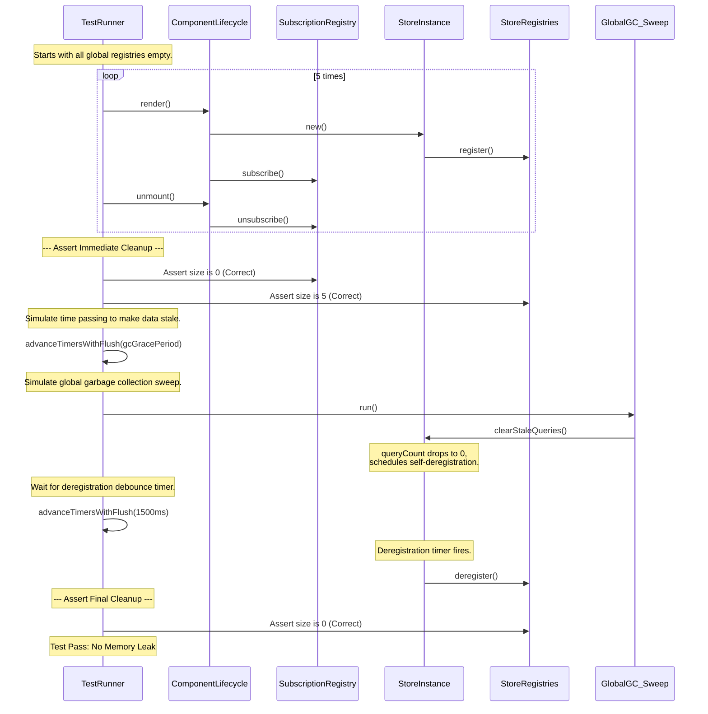
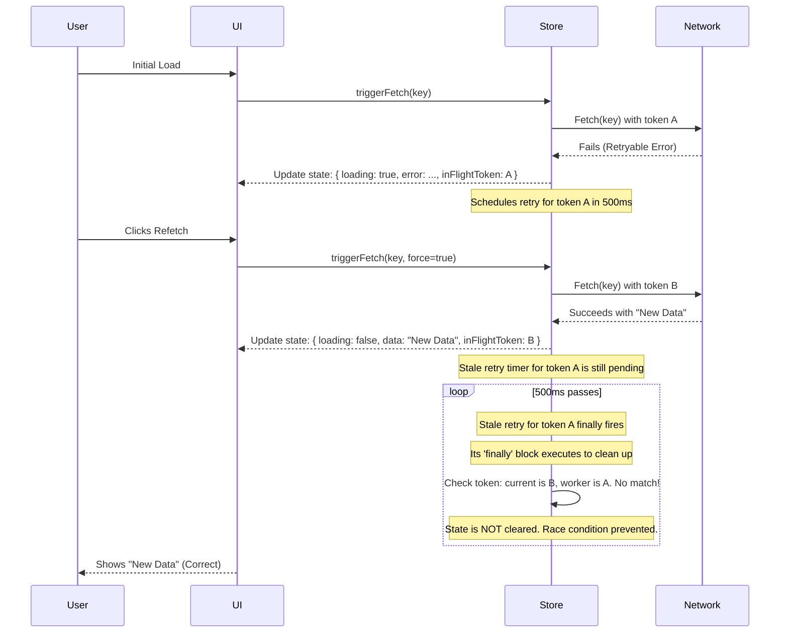
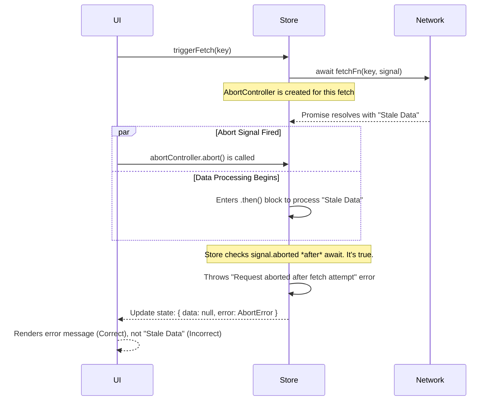
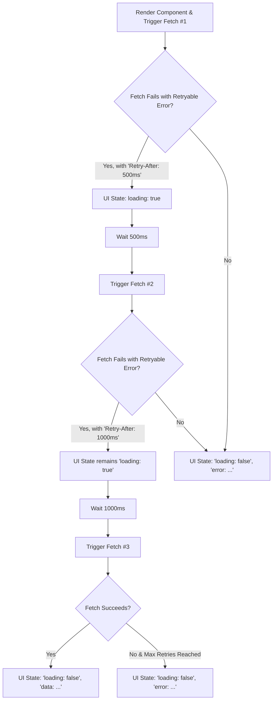

# API Store Factory - Testing Strategy

---

### Introduction

This document outlines the comprehensive testing strategy for the **API Store Factory**, a system designed to provide robust, cached, and concurrent data fetching for React applications. The primary goal of the test suite is to guarantee the correctness and long-term stability of the store, ensuring it is resilient to network failures, immune to common race conditions, and free of memory leaks.

The strategy employs a multi-layered approach, combining fine-grained **unit tests** for critical utilities, **architectural tests** for DI contracts, **component-level tests** for React-specific behavior, and high-level **integration tests** that validate the end-to-end lifecycle of a store instance.

---

## Test Suite Structure

The test suite is organized by concern, with a clear separation between different testing goals. This modular structure is enabled by a foundation of shared helpers that ensure all tests are DRY, deterministic, and maintainable.

| File Path                                 | Purpose                                                                                                                                     |
| ----------------------------------------- | ------------------------------------------------------------------------------------------------------------------------------------------- |
| `tests/adapter/*.test.ts`                 | **Adapter Tests:** Isolates and verifies that each adapter correctly implements its contract (e.g., `axiosErrorMapper`, `loglevelAdapter`). |
| `tests/utils/*.test.ts`                   | **Unit Tests:** Focuses on the specific logic of pure, dependency-free utilities (e.g., `getQueryKey`, `zustand-utils`).                    |
| `tests/core/architectural.test.tsx`       | **Architectural Tests:** "White-box" tests that verify the internal DI contracts of the pure core.                                          |
| `tests/core/render.test.tsx`              | **Component Tests:** Validates React-specific rendering behavior, ensuring stability and preventing infinite loops.                         |
| `tests/core/retries.test.tsx`             | **Component Tests:** Validates the complete error and retry lifecycle from the component's perspective.                                     |
| `tests/core/race-conditions.test.tsx`     | **Component Tests:** A critical suite that deterministically simulates and verifies the handling of complex race conditions.                |
| `tests/core/core.test.tsx`                | **Component Tests:** Verifies core features like caching, polling, and deduplication through the `useApiQuery` hook.                        |
| `tests/integration/lifecycle.test.tsx`    | **Integration Tests:** Validates the end-to-end lifecycle of stores to prove the absence of memory leaks.                                   |
| `tests/integration/entry-points.test.tsx` | **Integration Tests:** Verifies that the public entry points (`index`, `pure`) correctly compose and export the library's features.         |

## Test Setup Philosophy & Core Helpers

To ensure all tests are deterministic, maintainable, and DRY, the suite is built on a foundation of shared helpers. These utilities abstract away common boilerplate for mocking, rendering, and, most importantly, controlling asynchronous behavior.

#### Deterministic Time & Asynchronicity

The key to reliably testing complex asynchronous UI is to gain full control over time. All tests use Vitest's fake timers (`vi.useFakeTimers()`). However, simply advancing timers is not enough when dealing with promises (like those from `fetch`) and React state updates.

The canonical helper `advanceTimersWithFlush` is used for all time-based operations. It solves a common flakiness problem by bundling three crucial steps into one atomic operation:

1.  Wraps the entire operation in React's `act()` to ensure state updates are properly batched.
2.  Advances the fake timers by the specified duration.
3.  Flushes the microtask queue (`Promise.resolve()`) to ensure any pending promises from the timer's expiration are fully resolved before the test continues.

```typescript
// Correct, robust usage for waiting for a retry timer.
// Sources: tests/core/retries.test.tsx
await advanceTimersWithFlush(500); // Advances time by 500ms and waits for promises to settle.
expect(mockFetch).toHaveBeenCalledTimes(2);
```

This approach eliminates race conditions within the test itself, guaranteeing that assertions are only made after all asynchronous work for a given time period has completed. (`Sources: tests/helper/async-helpers.ts`)

---

#### Controlled Store Instantiation

Each test requires a clean, isolated instance of the API store. The following helpers provide a controlled environment for every test scenario.

| Helper Function              | Description                                                                                                                                                                                                                            |
| ---------------------------- | -------------------------------------------------------------------------------------------------------------------------------------------------------------------------------------------------------------------------------------- |
| **`createTestableApiStore`** | A low-level factory that creates a store instance and provides test-only accessors for its internal state (`getStoreState`, `getInternalStore`). Essential for "white-box" testing of complex lifecycle logic like garbage collection. |
| **`setupApiTest`**           | A high-level, all-in-one helper used by most tests. It combines `createTestableApiStore`, fetch mocking (`vi.fn()`), and component rendering (`render`) into a single async call, drastically reducing boilerplate.                    |

_Sources: `tests/helper/api-store.test-helpers.tsx`_

#### Standardized Test Components

To consistently render and interact with the `useApiQuery` hook, the suite uses a set of standard, reusable test components.

- **`DataConsumer`**: The default component for most tests. It renders the hook's complete state (`data`, `loading`, `error`) and provides interactive buttons (`refetch`, `clear`) to simulate user actions.
- **`RenderTracker`**: A specialized version of `DataConsumer` that additionally tracks and displays its own render count. This is used specifically in the `render.test.tsx` suite to verify rendering precision and prevent infinite loops.

_Sources: `tests/helper/test-components.tsx`_

---

## Testing overview

### Core Store Functionality

This category of tests validates the fundamental, day-to-day features of the API store, ensuring that caching, polling, request deduplication, and state management APIs behave as expected. These tests are primarily located in `core.test.tsx` and confirm the store's core contract with its consumers.

The following table summarizes the key features and the specific behaviors verified by the test suite.

| Feature                   | Scenario Tested                                                                     | Key Assertion / Purpose                                                                                                          |
| ------------------------- | ----------------------------------------------------------------------------------- | -------------------------------------------------------------------------------------------------------------------------------- |
| **Caching (TTL)**         | A component remounts _within_ the `cacheTTL` period.                                | Verifies that no new network request is made and data is served from the cache.                                                  |
|                           | A component remounts _exactly at_ the `cacheTTL` boundary.                          | Confirms that the cache is considered stale and a new network request is triggered, proving the boundary condition is correct.   |
|                           | `cacheTTL` is set to `0` or a negative value.                                       | Proves that caching is completely disabled and every mount triggers a new fetch.                                                 |
| **Polling**               | `refetchIntervalMinutes` is configured.                                             | Confirms that a background refetch is automatically triggered after the specified interval elapses.                              |
| **Request Deduplication** | Two components subscribing to the same query mount concurrently.                    | Verifies that only a single underlying API request is made for both components, preventing redundant network calls.              |
| **Store Isolation**       | Two independent stores created from the factory are used on the same page.          | Proves that actions on one store (e.g., `refetch`) do not interfere with the state or behavior of the other store.               |
| **State Management**      | The `clearQueryState` action is called on a query with an active polling timer.     | Verifies that the state is removed _and_ that associated resources (like the `setTimeout` for the poll) are properly cleaned up. |
|                           | The `clearAll` action is called on a store with multiple active and cached queries. | Confirms that the entire store's state is wiped and that all associated resources (timers, abort controllers) are cleaned up.    |

_Sources: `tests/core/core.test.tsx`_

### Garbage Collection & Lifecycle Management

The API store is designed for long-lived single-page applications, making automatic resource cleanup a critical feature. The garbage collection (GC) and lifecycle system is responsible for preventing memory leaks by automatically evicting stale, unused data and deregistering idle store instances.

The test suite validates this system at two levels: **unit tests** verify the individual rules and mechanisms of the GC, while a high-level **integration test** proves that these rules work together flawlessly to prevent memory leaks over the entire application lifecycle.

#### Unit Tests: Verifying Core GC Mechanisms

Tests in `garbage-collector.test.tsx` verify the non-negotiable rules of the garbage collector to ensure data integrity and safety.

| Scenario                                  | Verification / Purpose                                                                                                                                                                |
| ----------------------------------------- | ------------------------------------------------------------------------------------------------------------------------------------------------------------------------------------- |
| **Mounted Component (Active Subscriber)** | Proves that the GC will **never** evict data for a query that is actively being used by a mounted component, even if the data is long past its stale-date (`gcGracePeriod`).          |
| **Active Polling Timer**                  | Confirms that the GC treats a query with an active `refetchInterval` as a "background service" and will **never** evict it, even if it has no active UI subscribers.                  |
| **Unmounted & Stale**                     | The "happy path" for GC. Verifies that once a component unmounts and the `gcGracePeriod` has passed, a GC sweep successfully removes the query data from the store.                   |
| **Unmounted but Within Grace Period**     | Confirms the GC respects the `gcGracePeriod`. If a component unmounts but the grace period has not yet elapsed, the data is preserved, allowing for fast remounts to reuse the cache. |
| **`clearAllApiStores` Global Action**     | A unit test verifies that the global `clearAllApiStores` function correctly broadcasts its command to all registered stores, a critical feature for app-level actions like logout.    |

_Sources: `tests/core/garbage-collector.test.tsx`, `tests/core/registry.test.ts`_

#### Integration Tests: End-to-End Validation

While unit tests verify the rules in isolation, integration tests in `lifecycle.test.tsx` ensure they work together to achieve the ultimate goals of stability and leak prevention.

| Scenario Tested                       | Verification / Purpose                                                                                                                                                                  |
| ------------------------------------- | --------------------------------------------------------------------------------------------------------------------------------------------------------------------------------------- |
| **End-to-End Memory Leak Prevention** | A smoke test that proves stores correctly self-deregister from all three global registries after becoming idle, guaranteeing the prevention of memory leaks in long-lived applications. |
| **Concurrent Error Isolation**        | Confirms that a store in a prolonged error/retry state does not interfere with the successful operation of a separate, concurrent store, proving robust module isolation.               |

The memory leak prevention test is the most critical integration test. It simulates a user navigating through multiple pages to validate the full, automatic lifecycle from store creation to final destruction, as visualized below.



_Sources: `tests/integration/lifecycle.test.tsx`_

### Race Conditions & Concurrency

This is arguably the most critical part of the test suite, as unhandled race conditions are a primary source of bugs, stale UI, and incorrect application state in asynchronous applications. The tests in `race-conditions.test.tsx` are specifically designed to create deterministic, predictable scenarios that prove the store's internal token mechanism (`inFlightToken`) is robust and correctly prevents stale data from overwriting fresh data.

#### The "Stale Worker" Problem

The most important race condition tested is the **"stale worker" problem**. This occurs when a previous, slow fetch request (or its retry) completes _after_ a newer, faster request for the same resource has already updated the state. The `inFlightToken` is a unique symbol created for each fetch cycle, ensuring that only the _currently active_ cycle is allowed to mutate the store's state.

The following sequence diagram models the test `Verifies token mechanism prevents a stale worker...`, which proves the token mechanism works correctly.



_Sources: `tests/core/race-conditions.test.tsx`_

#### The "Abort After Resolution" Race

Another subtle but critical race condition occurs when a `fetch` promise resolves, but an abort signal is triggered _before_ the application has a chance to process the resolved data. A naive implementation might incorrectly display this stale data. The test suite verifies that the store correctly identifies this scenario and discards the data.



_Sources: `tests/core/race-conditions.test.tsx` (`Verifies store discards data if fetch is aborted...`)_

#### Other Concurrency Scenarios Tested

In addition to these core race conditions, the suite covers other concurrency scenarios to ensure complete robustness.

| Scenario Tested                    | Verification / Purpose                                                                                                                                                                 |
| ---------------------------------- | -------------------------------------------------------------------------------------------------------------------------------------------------------------------------------------- |
| **Forced Refetch Aborts Previous** | Confirms that when a user triggers a forced refetch, any in-progress request for that same query is immediately sent an `abort` signal.                                                |
| **Clear During Flight**            | Ensures that if a query is cleared (`clearQueryState`) while its fetch is in-flight, the eventual resolution of that fetch is ignored and does not resurrect the state.                |
| **Refetch During Retry Delay**     | Proves that a manual refetch and a scheduled retry can coexist. The test verifies that the scheduled retry is _not_ cancelled, and both requests are allowed to proceed independently. |
| **Concurrent Error Isolation**     | An integration test that proves an error and prolonged retry loop in one query has zero impact on a separate, successful, concurrent query, ensuring robust module isolation.          |

_Sources: `tests/core/race-conditions.test.tsx`, `tests/integration/lifecycle.test.tsx`_

### Error Handling & Retries

The test suite places a strong emphasis on ensuring the store is resilient to transient network or server errors. The goal is to provide a seamless user experience by automatically recovering from failures where possible, while maintaining a correct and informative UI state throughout the process. Tests in `retries.test.tsx` and `axios.test.ts` cover this lifecycle thoroughly.

#### Key Retry Scenarios Tested

| Scenario                         | Verification / Purpose                                                                                                                                                            |
| -------------------------------- | --------------------------------------------------------------------------------------------------------------------------------------------------------------------------------- |
| **`retryAttempts` Option**       | A parameterized test confirms that the store makes the exact number of configured total fetch attempts, correctly handling edge cases like `0` (coerced to 1).                    |
| **Server `Retry-After` Header**  | Proves that the store prioritizes the server-provided backoff delay (from a rate-limiting `429` response) over the client-side default exponential backoff.                       |
| **Non-Retryable Errors**         | Confirms that the store immediately stops the retry cycle for non-transient failures (e.g., HTTP 404, authorization errors) and displays the error state.                         |
| **Loading State During Retries** | A critical UX test that verifies the `loading` state remains `true` for the _entire duration_ of the retry process, preventing any flicker of an intermediate error state.        |
| **Synchronous `fetchFn` Errors** | An edge case test to ensure the store's internal `try/catch` blocks can handle cases where the provided fetch function throws an error synchronously, before returning a promise. |

_Sources: `tests/core/retries.test.tsx`, `tests/adapter/axios.test.ts`_

#### The Retry Lifecycle

The full retry lifecycle is a state machine that involves multiple fetch attempts, controlled delays, and consistent UI state management. The test `Verifies retry logic respects server 'retry-after' header...` validates this entire flow, which is visualized below.



_Sources: `tests/stores/retries.test.tsx`_

To ensure the `retryAttempts` logic is thoroughly tested, the suite uses a data-driven, parameterized test. This approach reduces code duplication and clearly documents the expected behavior for a range of inputs in a single, easy-to-read block.

```typescript
// Example of the parameterized test for the `retryAttempts` option.
// Sources: tests/stores/retries.test.tsx

const testCases = [
  {
    description:
      'it makes 1 total call and fails, respecting the floor value of 1',
    retryAttempts: 0, // Edge case: should be coerced to 1.
    expectedCalls: 1,
    shouldSucceed: false,
  },
  {
    description: 'it makes 3 total calls and succeeds on the third',
    retryAttempts: 3,
    expectedCalls: 3,
    shouldSucceed: true,
  },
];

test.each(testCases)(
  'Verifies with retryAttempts = $retryAttempts, $description',
  async ({ retryAttempts, expectedCalls, shouldSucceed }) => {
    // ... test implementation
  },
);
```

### Component-Level & Rendering Tests

A core responsibility of the `useApiQuery` hook is to be a well-behaved React citizen. This means it must not only provide correct data but also do so efficiently, preventing unnecessary re-renders and behaving predictably within React's lifecycle. A dedicated suite in `render.test.tsx`, along with specific tests in `garbage-collector.test.tsx`, verifies these critical integration points with the React framework.

The primary goals are to ensure rendering is precise, stable, and robust, especially under modern React features like Strict Mode.

| Scenario Tested                        | Verification / Purpose                                                                                                                                                                                                                            |
| -------------------------------------- | ------------------------------------------------------------------------------------------------------------------------------------------------------------------------------------------------------------------------------------------------- |
| **Render Precision**                   | Proves that a component subscribing to a query only re-renders when _its specific slice_ of the state changes. It correctly ignores state updates from other, unrelated queries, a key benefit of the Zustand selectors.                          |
| **Render Stability & Loop Prevention** | Asserts that the number of initial renders is a small, finite number. This confirms the hook provides stable state and function references, preventing "Maximum update depth exceeded" errors and infinite render loops.                          |
| **React Strict Mode**                  | Confirms that the hook's subscription and cleanup logic is idempotent. It correctly handles Strict Mode's development-only double-invocation of `useEffect` without causing memory leaks, duplicate subscriptions, or redundant network requests. |
| **Rapid Mount/Unmount Cycles**         | A stress test that simulates a user rapidly navigating back and forth. It verifies that the hook's deduplication and cleanup logic work correctly under pressure, resulting in only a single network request and no orphaned subscriptions.       |

_Sources: `tests/core/render.test.tsx`, `tests/core/garbage-collector.test.tsx`_

### Architectural & Entry Point Tests

This suite of "white-box" tests validates the library's internal architecture and public API contracts. Unlike behavioral tests, which confirm _what_ the library does, these tests confirm _how_ it is built, ensuring the dependency injection model and public entry points work as designed.

| Scenario Tested                          | Verification / Purpose                                                                                                                                                        |
| ---------------------------------------- | ----------------------------------------------------------------------------------------------------------------------------------------------------------------------------- |
| **Injected `errorMapper` Usage**         | Proves that the pure core correctly calls the `errorMapper` function provided in its dependencies when a fetcher fails, confirming the DI contract is honored.                |
| **Injected `logger` Usage**              | Confirms that if an internal utility (like `getQueryKey`) fails, the hook catches the error and reports it using the injected logger.                                         |
| **Component Resilience**                 | Verifies that an internal error (e.g., from an invalid `apiPathKey`) does not crash the React component but instead results in a stable, rendered error state.                |
| **"Pure" Entry Point Decoupling**        | An integration test that proves the `factora/pure` entry point is truly decoupled and can be configured with completely mocked dependencies, without pulling in adapter code. |
| **"Convenient" Entry Point Composition** | An integration test that confirms the main `factora` entry point correctly composes the pure core with the real `axiosErrorMapper` and `loglevelAdapter`.                     |

_Sources: `tests/core/architectural.test.tsx`, `tests/integration/entry-points.test.tsx`_
